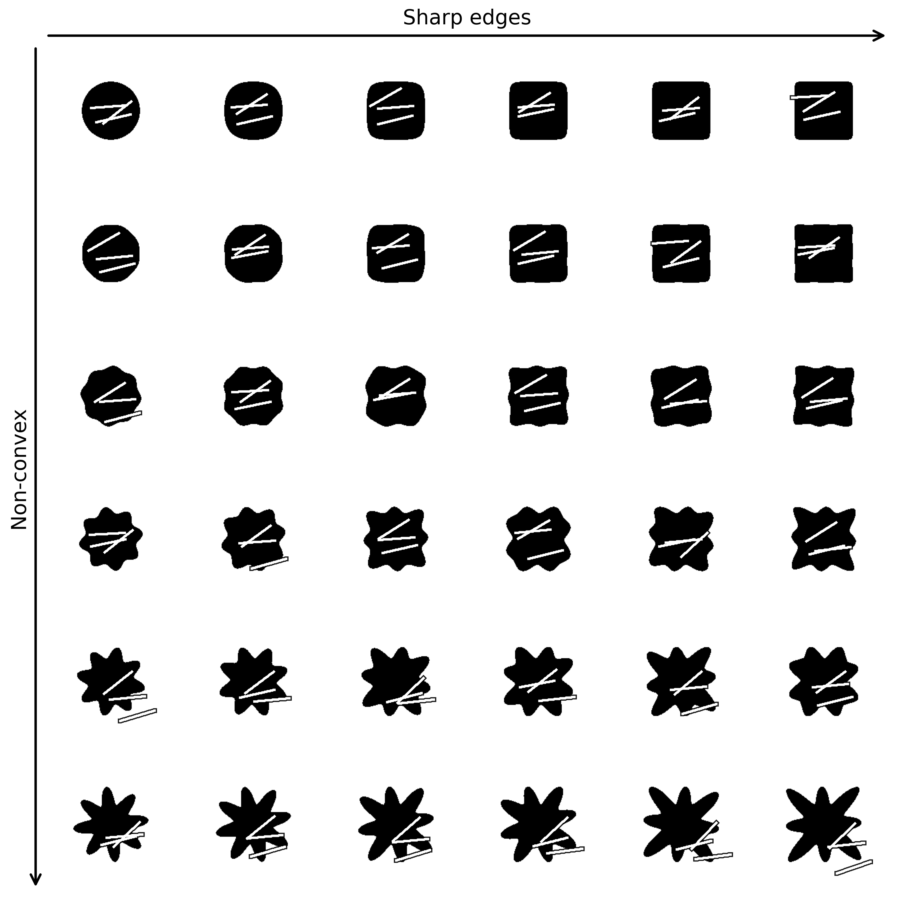

# SDCNN (Spatially Differentiable Convolutional Neural Network) for robot pose prediction.


**Author:** Alexander (Aleks) E. Siemenn <asiemenn@mit.edu>

## Overview

Integrating autonomous contact-based robotic characterization into self-driving laboratories can enhance measurement quality, reliability, and throughput. While deep learning models support robust autonomy, current methods lack pixel-precision positioning and require extensive labeled data. To overcome these challenges, we propose a self-supervised convolutional neural network with a spatially differentiable loss function, incorporating shape priors to refine predictions of optimal robot contact poses for semiconductor characterization. This network improves valid pose generation by 20.0%, relative to existing models. We demonstrate our network's performance by driving a 4-degree-of-freedom robot to characterize photoconductivity at 3,025 predicted poses across a gradient of perovskite compositions, achieving throughputs over 125 measurements per hour. Spatially mapping photoconductivity onto each drop-casted film reveals regions of degradation. With this self-supervised deep learning-driven robotic system, we enable high-precision and reliable automation of contact-based characterization techniques at high throughputs, thereby allowing the measurement of previously inaccessible yet important semiconductor properties for self-driving laboratories.

## Repository Structure

| File/Folder               | Description                                                                                                                                    |
|---------------------------|------------------------------------------------------------------------------------------------------------------------------------------------|
| [examples.ipynb](./examples.ipynb)         | Jupyter notebook demonstrating the pipeline and usage examples of the self-supervised convolutional neural network for robotic characterization.|
| [sdcnn.py](./sdcnn.py)                | Python module defining the architecture of the self-supervised convolutional neural network with spatially differentiable loss function.       |
| [utils.py](./utils.py)                | Utility functions used across the pipeline, including data preprocessing, image handling, and metrics calculations.                            |
| [data](./data)                    | Directory where data automatically downloads to for running the models within [examples.ipynb](./examples.ipynb).|
| [training/training.py](./training/training.py)    | Python script for training the SDCNN model, including loading datasets, defining loss functions, and logging results during model training.      |

## Requirements

To run the code in this repository, you will need the following dependencies:
- Python >= 3.9
- joblib==1.1.0
- matplotlib==3.8.3
- numpy==1.26.4
- torch==2.2.1+cpu
- requests==2.31.0
- opencv-python==4.9.0

Install all dependencies using:
```bash
pip install -r requirements.txt
```

## Quick Start
1. Run [examples.ipynb](./examples.ipynb) for a self-contained example usage of the SDCNN.
2. Training data preparation: Download input data files (augmented_dataset_fastSAM.pkl) from the data directory [https://osf.io/download/c6xtg](https://osf.io/download/c6xtg) 
3. Run the training script:
```bash
python training/training.py
```

## Model Architecture
Our convolutional neural network (CNN) is designed with a spatially differentiable loss function to ensure pixel-level accuracy in contact-based robotic positioning. The network is self-supervised, enabling it to learn optimal poses for robotic contact without the need for extensive labeled datasets. We incorporate shape priors to enhance the robustness and accuracy of predicted poses.

## Results
All results and model weights can be found on the [public OSF repository](https://osf.io/sdy7k/). This approach achieves a 20.0% improvement in valid pose generation compared to existing models, with a throughput of 125 measurements per hour for photoconductivity characterization across semiconductor materials. Results of predicted poses onto shape priors of varying convexity and sharpness from [examples.ipynb](./examples.ipynb).


